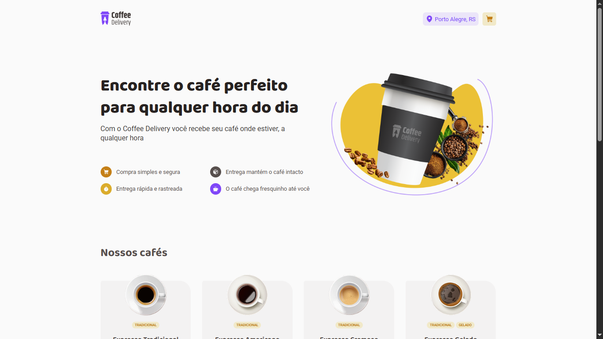

# ☕ Coffee Delivery

**Encontre o café perfeito para qualquer hora do dia.**  
Com o Coffee Delivery, você recebe seu café onde estiver, a qualquer hora.



---

## ✨ Funcionalidades

- ✅ Listagem de cafés disponíveis para compra
- ✅ Adição de quantidade específica de cafés no carrinho
- ✅ Aumento ou remoção da quantidade de cafés no carrinho
- ✅ Formulário para preenchimento do endereço de entrega
- ✅ Exibição do total de itens no carrinho no cabeçalho
- ✅ Cálculo do valor total da compra (quantidade × preço unitário)
- ✅ Armazenamento do carrinho no LocalStorage

---

## 💡 Benefícios da plataforma

- **Compra simples e segura**  
- **Entrega que mantém o café intacto**
- **Entrega rápida e rastreável**
- **O café chega fresquinho até você**

---

## 📦 Tecnologias utilizadas

- ReactJS
- Context API
- LocalStorage
- Vite
- TypeScript
- Styled-components

---

## 🚀 Como executar o projeto

### 1. Clone o repositório

```bash
git clone https://github.com/seu-usuario/coffee-delivery.git
cd coffee-delivery
```

### 2. Instale as dependências

```bash
npm install
# ou
yarn install
```

### 3. Inicie o servidor de desenvolvimento

```bash
npm run dev
# ou
yarn dev
```
